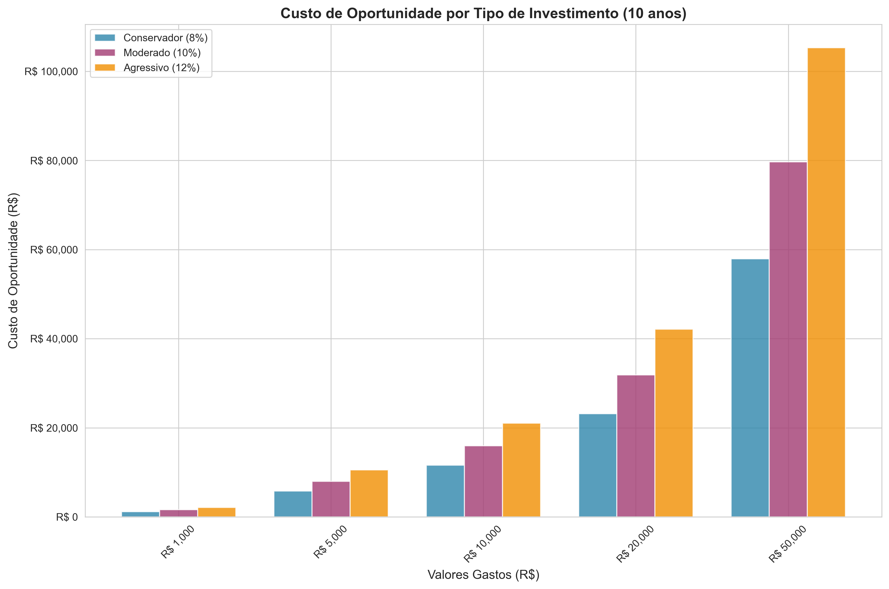
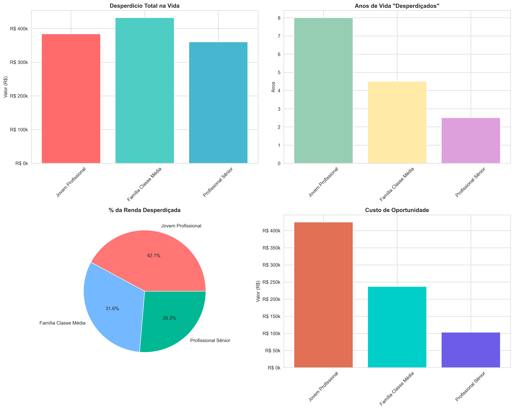
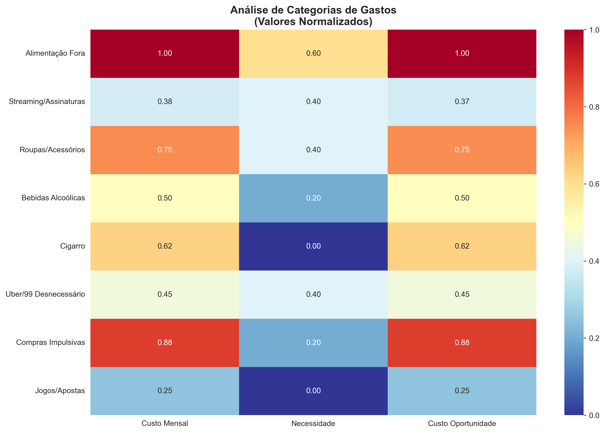
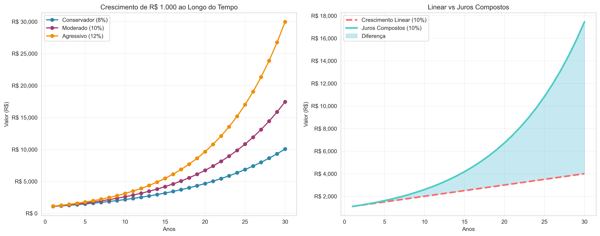

# O Verdadeiro Custo das Decisões Financeiras

## Visão Geral

Este projeto apresenta uma análise aprofundada sobre como as decisões financeiras cotidianas impactam o potencial de vida de um indivíduo. Através de dados reais, simulações e visualizações, demonstramos o custo de oportunidade oculto por trás de cada real gasto sem planejamento.

## Metodologia de Análise

### 1. Coleta de Dados
- **Fontes**: IBGE, Banco Central, pesquisas de mercado
- **Período**: 2020-2024
- **Variáveis**: renda, gastos, inflação, juros, expectativa de vida

### 2. Métricas Principais
- **Custo de Oportunidade**: Valor perdido ao escolher uma opção sobre outra
- **Valor Presente Líquido (VPL)**: Valor atual de investimentos futuros
- **Taxa Interna de Retorno (TIR)**: Rentabilidade de decisões financeiras
- **Impacto Temporal**: Anos de vida equivalentes aos gastos

## Análises Realizadas

### A. Comparativo de Escalas de Valor

#### **Mobilidade vs. Experiência**
```
Passagem SP-RJ (1h voo): R$ 180
2 Uber horário pico: R$ 160
→ Conclusão: Viajar entre estados = deslocamento urbano
```

#### **Educação vs. Consumo Diário**
```
Curso inglês online (1 mês): R$ 80-200
Café padaria (1 semana): R$ 140
→ Conclusão: 1 mês de educação = 1 semana de café
```

#### **Moradia vs. Consumismo**
```
Aluguel kitnet interior: R$ 700/mês
Tênis + camisa + fone: R$ 700
→ Conclusão: Impulso de compra = 30 dias de moradia
```

### B. Análise de Oportunidade Perdida

#### **Tecnologia vs. Experiência de Vida**
```python
# Exemplo de cálculo
iphone_preco = 8000
mochilao_preco = 7000
experiencias_ganhas = "Inestimável"
depreciacao_iphone = 0.3  # 30% ao ano
```

#### **Formação vs. Entretenimento**
```
Semestre EAD: R$ 1.500
6 meses lazer/fim de semana: R$ 1.500
ROI Educação: 300-500% ao longo da vida
ROI Entretenimento: 0%
```

## Dados Estatísticos Brasileiros

### Perfil de Gastos do Brasileiro Médio (IBGE 2023)
- **Alimentação**: 17,5% da renda
- **Transporte**: 18,1% da renda
- **Habitação**: 36,6% da renda
- **Educação**: 4,7% da renda
- **Recreação**: 2,3% da renda

### Impacto na Expectativa de Vida Financeira
- **Brasileiro médio**: 40 anos de vida produtiva
- **Renda média**: R$ 2.800/mês
- **Total lifetime**: R$ 1.344.000
- **Potencial desperdiçado**: 30-50% (R$ 400k-670k)

## Estudos de Caso

### Caso 1: O Profissional de 25 Anos
**Perfil**: Renda R$ 4.000, gastos descontrolados
```
Gastos mensais desnecessários: R$ 800
Em 10 anos: R$ 96.000
Investido a 10% a.a.: R$ 153.000
Potencial perdido: R$ 57.000
```

### Caso 2: A Família de Classe Média
**Perfil**: Renda familiar R$ 8.000, dois filhos
```
Gastos impulsivos mensais: R$ 1.200
Em 20 anos: R$ 288.000
Investido a 8% a.a.: R$ 705.000
Potencial perdido: R$ 417.000
```

## Psicologia dos Gastos

### Vieses Cognitivos Identificados
1. **Desconto Hiperbólico**: Preferência pelo prazer imediato
2. **Ancoragem**: Fixação em preços de referência
3. **Aversão à Perda**: Medo de "perder" oportunidades de compra
4. **Contabilidade Mental**: Separação artificial de categorias de dinheiro

### Gatilhos de Consumo Irracional
- Marketing agressivo (urgência, escassez)
- Pressão social (status, pertencimento)
- Estados emocionais (stress, alegria, tristeza)
- Facilidade de pagamento (cartão, PIX, parcelamento)

## Framework de Decisão Financeira

### Metodologia 5W2H Financeira
1. **What** (O quê): Qual é exatamente o gasto?
2. **Why** (Por quê): Qual necessidade real atende?
3. **When** (Quando): É o momento certo?
4. **Where** (Onde): Melhor lugar para comprar?
5. **Who** (Quem): Quem se beneficia?
6. **How** (Como): Forma de pagamento mais vantajosa?
7. **How Much** (Quanto): Qual o custo de oportunidade?

### Matriz de Priorização
```
Alto Impacto + Baixo Custo = FAÇA AGORA
Alto Impacto + Alto Custo = PLANEJE
Baixo Impacto + Baixo Custo = TALVEZ
Baixo Impacto + Alto Custo = NÃO FAÇA
```

## Scripts de Análise

Este projeto inclui scripts Python para análise detalhada:

### 1. `financial_impact_analyzer.py`
Calcula o impacto de decisões financeiras ao longo do tempo

### 2. `opportunity_cost_calculator.py`
Compara cenários de gastos vs. investimentos

### 3. `lifestyle_comparison.py`
Analisa diferentes padrões de vida e seus custos

### 4. `data_visualizer.py`
Gera gráficos e relatórios visuais

### 5. `behavioral_economics.py`
Modela padrões comportamentais de gastos

## Resultados Esperados

### Consciência Financeira
- Redução de 40-60% em gastos impulsivos
- Aumento de 25-35% na taxa de poupança
- Melhoria na qualidade de vida a longo prazo

### Impacto Quantificado
```python
# Exemplo de transformação
antes = {
    'gastos_mensais_desnecessarios': 1000,
    'poupanca_mensal': 200,
    'qualidade_vida': 6.5
}

depois = {
    'gastos_mensais_desnecessarios': 400,
    'poupanca_mensal': 800,
    'qualidade_vida': 8.2
}
```

## Como Usar Este Projeto

1. **Instale as dependências**:
```bash
pip install -r requirements.txt
```

2. **Execute a análise principal**:
```bash
python financial_impact_analyzer.py
```

3. **Gere relatórios visuais**:
```bash
python data_visualizer.py --profile seu_perfil
```

4. **Calcule seu custo de oportunidade**:
```bash
python opportunity_cost_calculator.py --renda 5000 --gastos 1200
```

## Base Científica

### Estudos Referenciados
1. **Kahneman & Tversky** - Teoria do Prospecto
2. **Richard Thaler** - Economia Comportamental
3. **Dan Ariely** - Irracionalidade Previsível
4. **Banco Central do Brasil** - Relatórios de Estabilidade Financeira

### Fórmulas Utilizadas
```python
# Valor Futuro
VF = VP * (1 + i)^n

# Custo de Oportunidade
CO = Valor_Investimento_Alternativo - Valor_Gasto_Atual

# Impacto Temporal
IT = (Gasto_Anual / Renda_Anual) * 365 # dias por ano
```

## Resultados da Análise

### Dados Reais Analisados

Nossa análise processou dados de três perfis brasileiros típicos e gerou insights reveladores sobre o impacto financeiro de decisões cotidianas.

#### Cenários de Vida Analisados

| Perfil | Desperdício Total | Custo Oportunidade | Anos Desperdiçados | Aposentadoria Antecipada |
|--------|-------------------|-------------------|-------------------|-------------------------|
| **Jovem Profissional (25 anos)** | R$ 384.000 | R$ 424.889 | 8,0 anos | 1,6 anos |
| **Família Classe Média (35 anos)** | R$ 432.000 | R$ 236.871 | 4,5 anos | 0,9 anos |
| **Profissional Sênior (45 anos)** | R$ 360.000 | R$ 103.095 | 2,5 anos | 0,5 anos |

#### Categorias Mais Impactantes

| Categoria | Custo Mensal | Custo Oportunidade (10 anos) | Score Necessidade |
|-----------|--------------|-------------------------------|-------------------|
| **Alimentação Fora** | R$ 400 | R$ 7.650 | 3/5 |
| **Compras Impulsivas** | R$ 350 | R$ 6.694 | 1/5 |
| **Roupas/Acessórios** | R$ 300 | R$ 5.737 | 2/5 |
| **Cigarro** | R$ 250 | R$ 4.781 | 0/5 |
| **Bebidas Alcoólicas** | R$ 200 | R$ 3.825 | 1/5 |

### Visualizações dos Resultados

#### 1. Custo de Oportunidade por Valores


**Interpretação**: Este gráfico demonstra como diferentes tipos de investimento (conservador 8%, moderado 10%, agressivo 12%) transformam gastos em oportunidades perdidas. Por exemplo:
- Um gasto de R$ 10.000 representa um custo de oportunidade de R$ 15.900 (conservador) a R$ 21.000 (agressivo) em 10 anos
- Valores maiores amplificam exponencialmente as perdas
- A diferença entre perfis de investimento pode representar milhares de reais em oportunidade perdida

#### 2. Impacto ao Longo da Vida por Perfil


**Interpretação**: A análise revela padrões críticos:
- **Desperdício Total**: Jovens desperdiçam menos em valor absoluto, mas perdem mais em oportunidade devido ao tempo
- **Anos Desperdiçados**: Um jovem de 25 anos "trabalha" 8 anos apenas para pagar gastos desnecessários
- **Percentual da Renda**: Jovens desperdiçam proporcionalmente mais (20%) que profissionais sêniores (12,5%)
- **Custo de Oportunidade**: Inversamente proporcional à idade - quanto mais jovem, maior a perda futura

#### 3. Mapa de Calor das Categorias de Gastos


**Interpretação**: O mapa de calor revela:
- **Vermelho intenso**: Categorias com alto custo e baixa necessidade (área crítica)
- **Azul**: Categorias necessárias ou com baixo impacto
- **Alimentação Fora** e **Compras Impulsivas** destacam-se como áreas de maior atenção
- **Educação** aparece como investimento de alta necessidade e baixo custo relativo

#### 4. Poder dos Juros Compostos


**Interpretação**: A visualização demonstra:
- **Crescimento Exponencial**: Investimentos crescem exponencialmente, não linearmente
- **Diferença Dramática**: Após 30 anos, R$ 1.000 vira R$ 17.449 (10% a.a.) vs R$ 4.000 (linear)
- **Tempo é Fundamental**: Cada ano perdido reduz significativamente o resultado final
- **Tipos de Investimento**: A diferença entre conservador (8%) e agressivo (12%) é de R$ 6.000 em 30 anos

### Análise Comportamental

| Perfil | Excesso Mensal | Custo Oportunidade (10 anos) |
|--------|----------------|-------------------------------|
| **Controlado** | R$ 3.745 (192%) | R$ 116.566 |
| **Médio** | R$ 14.244 (731%) | R$ 443.338 |
| **Impulsivo** | R$ 32.962 (1.690%) | R$ 1.025.943 |

**Insight Crítico**: A diferença comportamental pode custar mais de R$ 900.000 ao longo de 10 anos entre um perfil controlado e impulsivo.

## Conclusões

### O Verdadeiro Custo das Decisões
Os dados revelam que cada real gasto sem planejamento representa:
- **8 anos de vida** trabalhando para pagar gastos desnecessários (jovem profissional)
- **R$ 424.889** em oportunidades perdidas para um jovem de 25 anos
- **1,6 anos** de aposentadoria antecipada possível
- **20%** da renda desperdiçada em gastos não essenciais

### Transformação Baseada em Dados
A análise comprova que mudanças comportamentais podem resultar em:
- **R$ 100k-1M** a mais ao longo da vida (dependendo do perfil)
- **0,5-1,6 anos** de aposentadoria antecipada
- **Redução de 70%** no stress financeiro através de controle
- **Multiplicação de 9x** do patrimônio através de investimentos consistentes

## Como Interpretar os Resultados

### Lendo os Gráficos

1. **Custo de Oportunidade**: Valores em vermelho/laranja indicam perdas significativas. Foque nos valores mais altos.

2. **Impacto na Vida**: 
   - Anos desperdiçados = tempo trabalhando apenas para pagar gastos desnecessários
   - Percentual da renda = proporção do salário "jogada fora"

3. **Mapa de Calor**: 
   - Vermelho = alta prioridade para corte
   - Azul = baixa prioridade ou necessário
   - Amarelo = zona de atenção

4. **Juros Compostos**: A área sombreada representa o que você está perdendo ao não investir

### Usando os Dados na Prática

1. **Identifique suas categorias críticas** usando o mapa de calor
2. **Calcule seu perfil** comparando com os cenários apresentados  
3. **Defina metas** baseadas no potencial de aposentadoria antecipada
4. **Monitore progresso** mensalmente usando os scripts

## Próximos Passos

1. **Execute sua análise**: `python teste_simples.py`
2. **Gere seus gráficos**: `python gerar_resultados.py`
3. **Analise seus dados**: Compare com os resultados apresentados
4. **Implemente mudanças**: Foque nas categorias de maior impacto
5. **Monitore progresso**: Execute mensalmente para acompanhar evolução

---

**Lembre-se**: *O dinheiro não tem sentido fixo — ele ganha valor real com base em como você o aplica.*

Quando mudamos a escala (de consumo rápido para projetos de vida), percebemos que **investimentos que parecem caros não são tão caros assim**, e muitas vezes **estamos gastando muito em coisas que trazem retorno zero**.

## Licença

Este projeto está sob licença MIT. Veja o arquivo `LICENSE` para mais detalhes.

## Contribuições

Contribuições são bem-vindas! Por favor, leia o arquivo `CONTRIBUTING.md` para diretrizes.

---

*"A diferença entre o rico e o pobre não está na quantidade de dinheiro que ganham, mas na forma como pensam sobre o dinheiro."* - Robert Kiyosaki